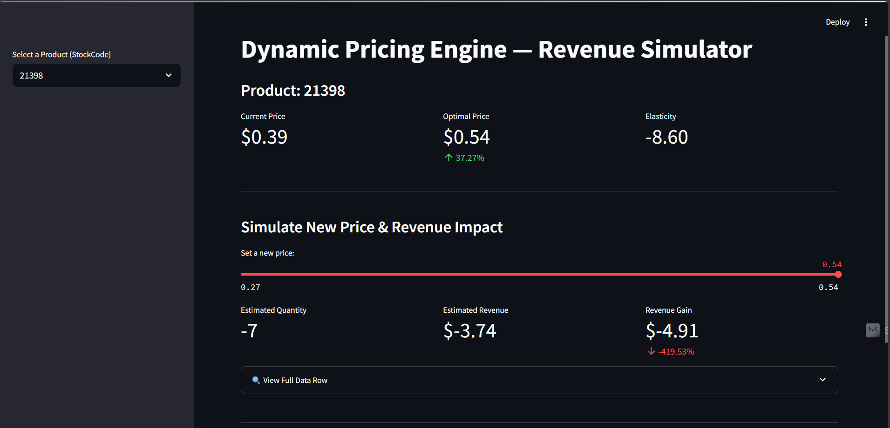

Dynamic Pricing Engine

An end-to-end ML-powered app that forecasts demand, estimates price elasticity, and recommends revenue-optimizing prices — complete with a Streamlit dashboard.

Features
- SQL + pandas-based data exploration
- Demand forecasting via Polynomial regression 
- Price elasticity estimation per item
- Revenue simulation using elasticity theory
- Streamlit dashboard for interactive analysis

Dashboard Preview

Project Structure
- `data/`: Cleaned + processed data
- `app.py`: Streamlit app
- `notebooks/`: Feature engineering, modeling

